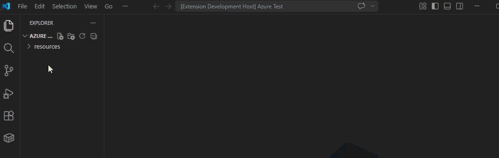

# Azure Blueprints – Pipeline Graph Editor

Azure Blueprints is a visual graph editor for Azure DevOps YAML pipelines. Open a pipeline file, view triggers, stages, jobs, and tasks as connected nodes, and edit the graph with live synchronization back to YAML.

## Features

- **Visual pipeline graph** – View triggers, stages, jobs, and tasks as connected nodes.
- **Live YAML synchronization** – Edit the graph and keep Azure DevOps YAML in sync in both directions.
- **Property editing** – Update task, trigger, and schedule settings in a side panel.
- **Task insertion** – Add steps from your Azure DevOps task catalog, including built-in `checkout: self` and `checkout: none` nodes.
- **Edge-drop context menu** – Drag from a stage or job node to choose whether to add a dependent stage, a job inside a stage, or a new task from the catalog.
- **Multiplicity constraints** – Job→task and task→task connections are 1:1: inserting or dragging automatically appends to the end of the chain rather than forking it.
- **Custom editor workflow** – Open supported pipeline YAML files in a dedicated graph editor from the Explorer or command palette.

## How It Works

1. Open a supported Azure DevOps pipeline YAML file such as `azure-pipelines.yml`.
2. Run **Open as Pipeline Graph Editor** from the Explorer context menu or command palette.
3. Edit the graph and keep the YAML synchronized as you make changes.

## Walkthrough

### Open the graph editor



### Add the first trigger node


### Add a stage


### Add a stage dependency


### Add a job


### Add a job dependency


### Add a task


## Architecture

| Module | Responsibility |
|--------|---------------|
| [src/extension.ts](src/extension.ts) | VS Code extension entry point; registers the editor and command |
| [src/PipelineEditorProvider.ts](src/PipelineEditorProvider.ts) | Custom text editor provider; owns the webview and document↔webview message bus |
| [src/taskCatalog.ts](src/taskCatalog.ts) | Fetches and caches the Azure DevOps task catalog via OAuth |
| [webview-ui/src/pipelineConverter.ts](webview-ui/src/pipelineConverter.ts) | YAML ↔ ReactFlow graph conversion logic |
| [webview-ui/src/App.tsx](webview-ui/src/App.tsx) | Root React component; wires graph canvas, panels, and menus |
| [webview-ui/src/components/PipelineGraph.tsx](webview-ui/src/components/PipelineGraph.tsx) | ReactFlow canvas with node/edge rendering |
| [webview-ui/src/components/PropertiesPanel.tsx](webview-ui/src/components/PropertiesPanel.tsx) | Sidebar panel for selected node properties |
| [webview-ui/src/components/ContextTaskMenu.tsx](webview-ui/src/components/ContextTaskMenu.tsx) | Right-click menu for inserting pipeline tasks |
| [webview-ui/src/components/ContextEdgeMenu.tsx](webview-ui/src/components/ContextEdgeMenu.tsx) | Edge-drop context menu shown when dragging from a stage or job node |
| [webview-ui/src/components/ContextTriggerMenu.tsx](webview-ui/src/components/ContextTriggerMenu.tsx) | Right-click menu shown on empty canvas to select a trigger type |

## API / Exports

### `pipelineToGraph(yaml: string): { nodes, edges }`
Parses an Azure DevOps YAML pipeline string and returns ReactFlow `nodes` and `edges` representing the trigger → stage → job → task hierarchy.

### `graphToPipeline(nodes, edges): string`
Serialises a ReactFlow graph back to Azure DevOps YAML.

### `insertTaskNode(input: InsertTaskInput, nodes, edges): { nodes, edges }`
Appends a new task node to the graph, auto-connecting it to the deepest leaf, and returns the updated `nodes` and `edges`.

### `insertTriggerNode(nodes, edges, triggerType: TriggerType): { nodes, edges }`
Adds (or replaces) the trigger node in the graph with the given trigger type, preserving all other nodes and edges.

### `class PipelineEditorProvider`
VS Code `CustomTextEditorProvider` implementation. Use `PipelineEditorProvider.register(context)` to activate.

### `fetchTaskCatalog(): Promise<TaskCatalogItem[]>`
Returns the full Azure DevOps task catalog for the configured organisation. Results are cached for the lifetime of the extension host.

### `clearTaskCatalogCache(): void`
Clears the in-memory task catalog cache, forcing the next `fetchTaskCatalog()` call to re-fetch.

### `findTaskInputs(taskRef: string): TaskInputDefinition[]`
Looks up the cached input schema for a task reference (e.g. `DotNetCoreCLI@2`). Returns an empty array if the catalog has not yet been fetched or the task was not found.

### `parseInputsRaw(raw: string | undefined): Record<string, string>`
Parses a YAML map string (the `inputsRaw` field stored on task nodes) into a plain `Record<string, string>`. All values are coerced to strings. Returns `{}` for `undefined`, malformed YAML, or YAML that is not a mapping.

## Template node architecture

Template references in Azure DevOps YAML (`- template: path.yml`) are parsed at all three pipeline levels:

| Level | YAML context | Graph column | Node `templateLevel` |
|-------|-------------|-------------|---------------------|
| Stage | `stages:` list | Stage (col 0) | `'stage'` |
| Job | `jobs:` list (inside a stage or top-level) | Job (col 1) | `'job'` |
| Step | `steps:` list | Task (col 2) | `'step'` |

Template nodes store `details.templatePath` (the file path string) and `details.parametersRaw` (YAML-encoded parameters). Editing either field in the Properties panel immediately re-serializes the YAML.

## Getting Started

### Prerequisites

- Node.js 18+
- VS Code 1.85+

### Install & Build

```sh
npm install
npm run build
```

Press **F5** in VS Code to launch the extension in a new Extension Development Host window.

### Running Tests

```sh
npm test
```

### Coverage

```sh
npm run test:coverage
```

## Configuration

- `azureBlueprints.organizationUrl` – Azure DevOps organization URL used to fetch the task catalog, for example `https://dev.azure.com/myorg`.

## Changelog

- 2026-04-07: Added task input schema — selecting a `task:` node now fetches structured input definitions from the Azure DevOps task catalog and renders them as typed form fields (text, checkbox, select, textarea) grouped by category in the Properties panel; 5 new tests for `parseInputsRaw` (221 total).
- 2026-04-07: Added template node support — stage, job, and step template references (`- template: path.yml`) are now parsed, displayed as distinct purple nodes, and round-trip through the YAML converter with full `parameters:` block support; 13 new tests (254 total).

## Changelog

- 2026-04-04: Switched the project to MIT open-source licensing, added public GitHub repository metadata, and updated the marketplace listing/support links for public distribution.
- 2026-04-02: Initial README generated from codebase.
- 2026-04-02: Fixed double-delete bug in PipelineGraph — node deletions now correctly sync the YAML in one keypress for both isolated nodes and nodes with connected edges.
- 2026-04-02: Fixed node deletion not immediately updating YAML — ReactFlow fires `onEdgesChange` before `onNodesChange` during deletion; edge removals now defer their `onGraphChange` call so `handleNodesChange` can cancel it and write the YAML once with both correct nodes and edges.
- 2026-04-03: Enforced single-input-edge constraint — connecting or re-routing an edge to a node that already has an incoming connection now replaces the old edge instead of creating a duplicate.
- 2026-04-04: Added trigger creation context menu — right-clicking an empty canvas with no trigger node now shows a menu with five trigger types (CI, PR, Scheduled, Manual, None).
- 2026-04-04: Added schedule trigger fields — Scheduled trigger properties panel exposes cron expression, schedule name, branches include/exclude, Always, and Batch; fully round-trips through YAML.
- 2026-04-04: Added CI trigger fields — CI trigger properties panel exposes Branches include/exclude, Paths include/exclude, Tags include/exclude, and Batch; `PipelineTrigger` type expanded accordingly; 16 new tests (125 total).
- 2026-04-03: Added PR trigger fields — PR trigger properties panel exposes Branches include/exclude, Paths include/exclude, Auto Cancel, and Drafts; added `PipelinePrTrigger` type; `getTriggerType` now detects `pr:` blocks; 16 new tests (141 total).
